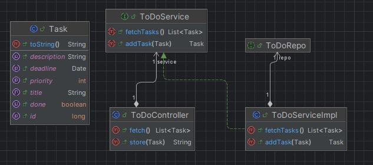
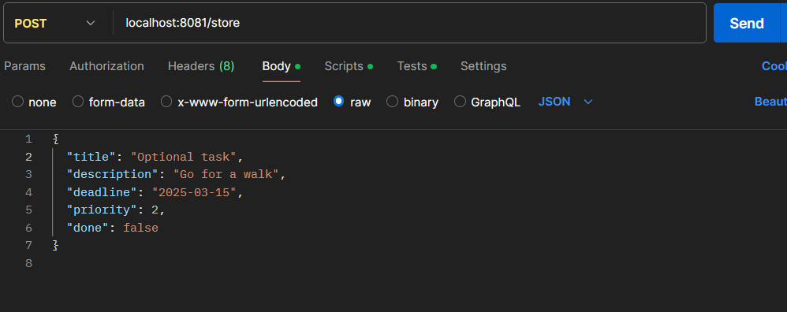
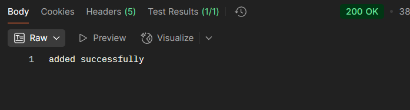
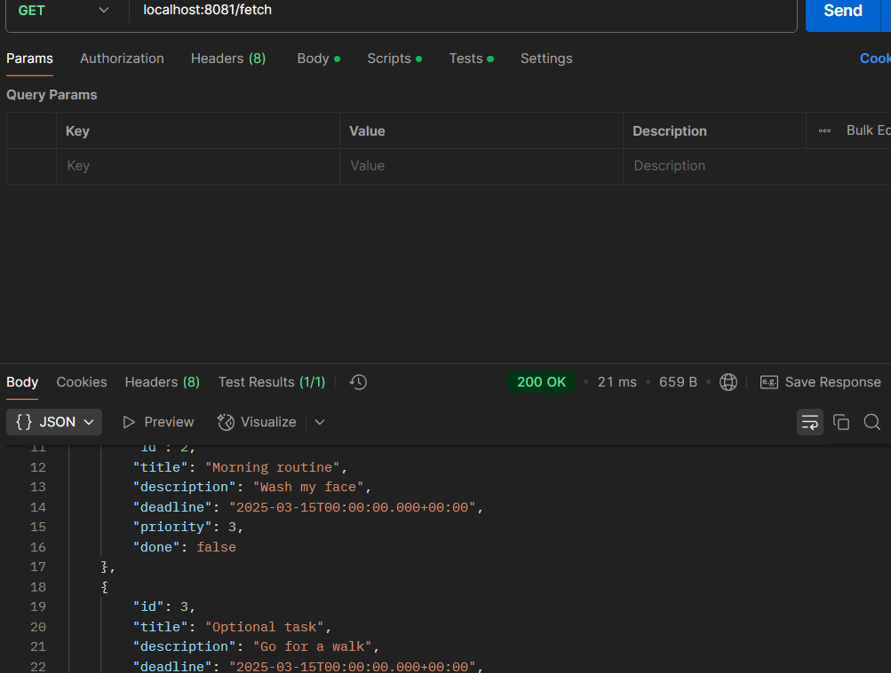
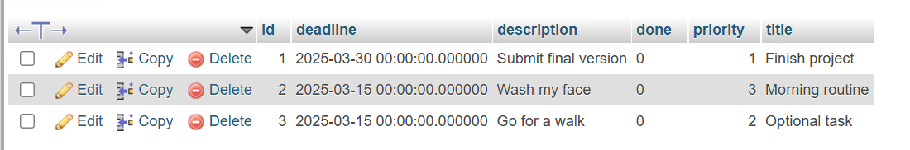

### Task Manager Application
This is a simple Task Manager application built with Spring Boot for the backend. The application allows users to add tasks, fetch tasks.

#### Features
Add a new task 
Fetch all tasks

#### Technologies Used
Spring Boot (Backend)
Spring Data JPA (Database Integration)
MySQL (Database)

#### Setup
##### Clone the repository:
```git clone https://github.com/mreckah/Spring_hospital_management```
Configure the database in application.properties.
Run the application using:
```mvn spring-boot:run```

#### Project Conception_



#### Demo using Postman
##### Add a Task
Endpoint: POST /store



Response:



Fetch Tasks
Endpoint: GET /fetch



Connected to database 




